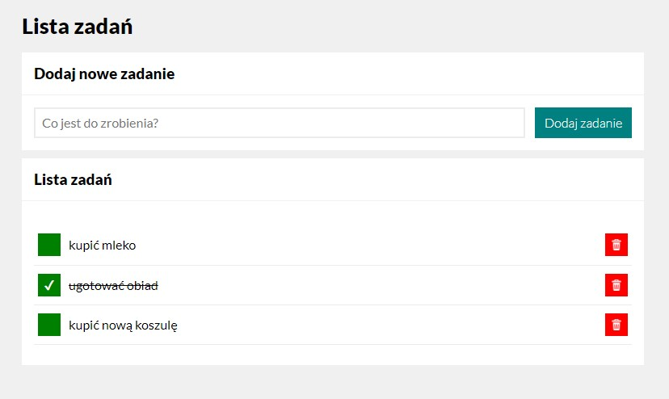

# SimpleTaskList (alpha release - PL lang)

Welcome to SimpleTaskList app!

## Demo

*(English version coming soon)*

https://dawidhm.github.io/SimpleTaskList/

## Description

**Simple Task List** is the application that helps you to keep away *frequent* and *short-term memory lapses* and manage all daily *to-do* tasks in one place.

Everything in one super simple shape to maximise your **effectiveness** and **productivity**.

## App Features
1. Adding new tasks   
1. Removing tasks
1. Marking tasks as done
1. **Special Feature**: Ultra fast task adding method

## Future Plans

- Add english language version
- Add functionality to save user data
- Add the order movement function for each task