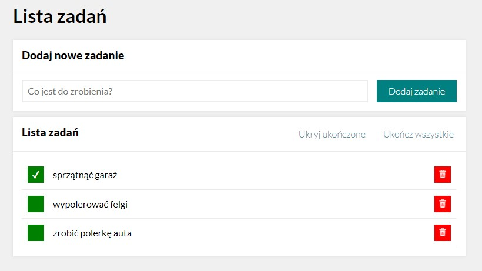
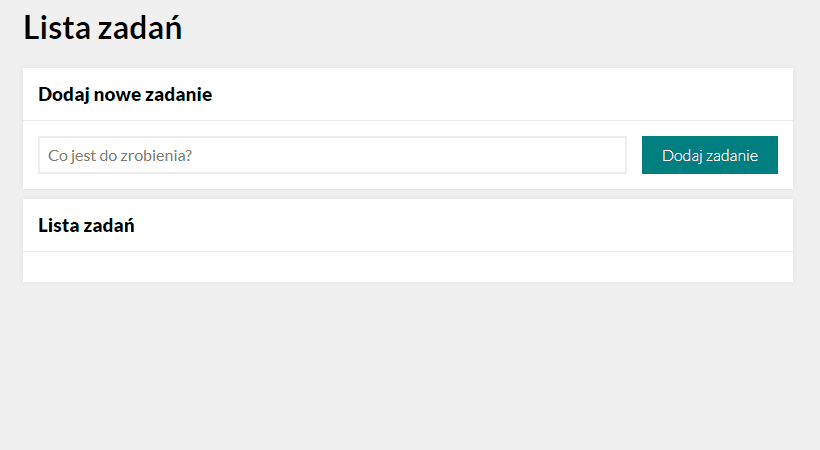
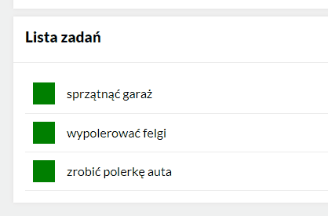
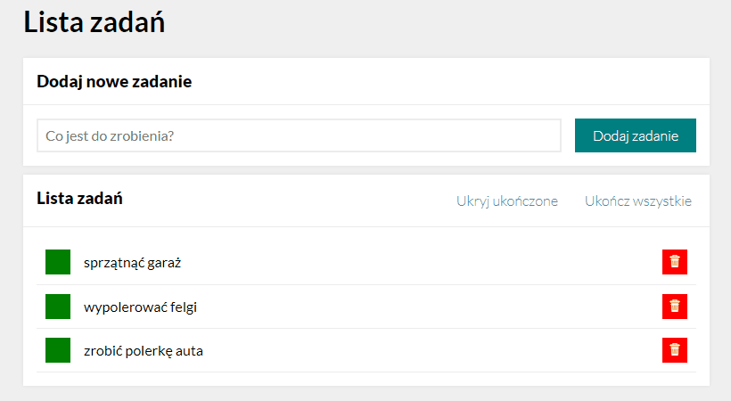
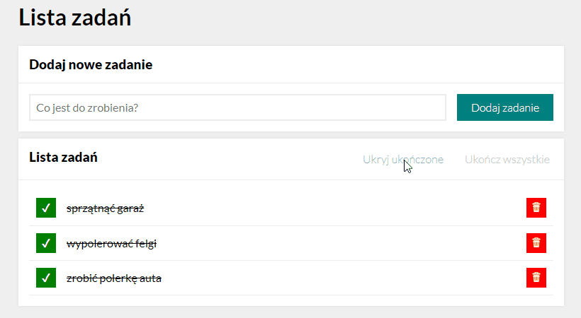
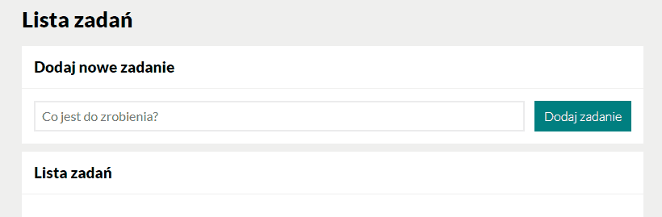
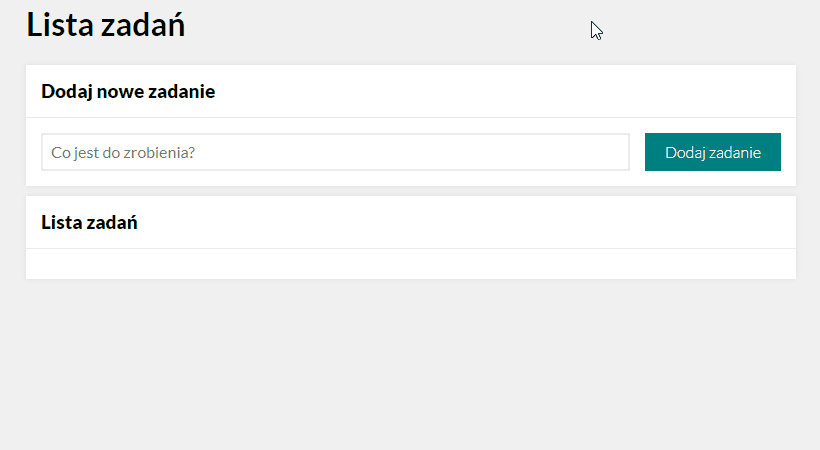

# SimpleTaskList

Welcome to SimpleTaskList app!

[**Caution!** This is the **early alpha release**. It is only possible to test the functionality of the application. At this stage, the application **will not save your tasks!** Once the site is *refreshed*, all assignments **will be gone**! Don't forget about it before you add tasks for the whole week!]

## Demo

(PL)
https://dawidhm.github.io/SimpleTaskList/

(ENG)
https://dawidhm.github.io/SimpleTaskList/index-en.html

## Description

**Simple Task List** is the application that helps you to keep away *frequent* and *short-term memory lapses* and manage all daily *to-do* tasks in one place.

Everything in one super simple shape to maximise your **effectiveness** and **productivity**.

### Power comes out of simplicity

The app is simple, so **it won't distract you** with a million *useless functions*, *goodies* and *blinking lights*. Just write down whatever you need to remember, then you can **focus** on doing the **most important thing** without worrying about a *thousand small things to remember* that might slip out of your head.

## App Features
1. Adding new task
1. Marking task as done
1. Marking all tasks as done
1. Hiding done tasks
1. Removing task
1. **Special Feature**: Ultra fast task adding methods

## 1. Adding new task.

To add a new task, select the input field, then write a task name and hit the button to add the task.

## 2. Marking task as done.

Once you've finished a task, you can mark it as done. To do this, press the green square on the left side of the task. A line through will appear on the task, and a completion mark will appear in the green square. 

You can also uncheck and recheck it as many times as you want.

## 3. (**New Feature**) Marking all tasks as done.

Now you can mark all completed tasks as completed with just one click.

## 4. (**New Feature**)  Hiding done tasks.

Another new feature is hiding completed tasks.

## 5. Removing task.

To remove a task, press the red bin icon placed on the right side of every task you want to remove.

## 6. **Special Feature:** Ultra fast task adding methods.

### **App can be used with just the keyboard**. 

You can easily switch between fields and buttons using *keyboard buttons combination*:

- forwards → with the **TAB** *button* 
- and backwards ← with the **SHIFT + TAB** 

After typing the task name, press **ENTER** *button* to add the task.

## **Auto-focus** and **input field reset**.

To make adding multiple tasks *faster* and *easier*, automatic selection of an input field has been added. This means that each time you **add a new task**, the **input field selects automatically** and **input field text clears**. 

You can quickly *enter multiple tasks* one by one, without having to select an input field and clearing field after each task is added.

To make this work *submit a new task* with the **ENTER** *key*. 

## Future Plans

- Add functionality to save user data
- Add the order movement function for each task

## Used Technology

- HTML 5
- CSS (with BEM, FLEX and GRID)
- JavaScript ES6+