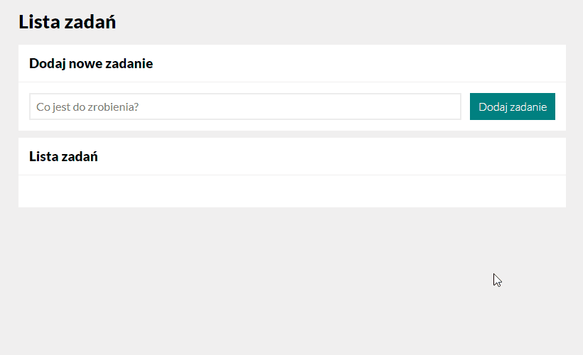
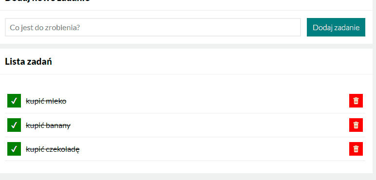
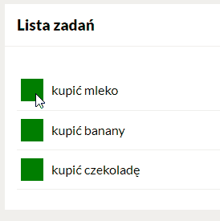
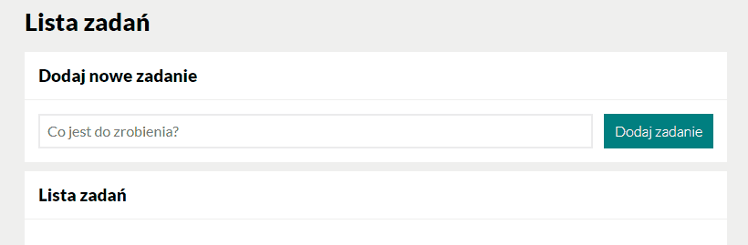
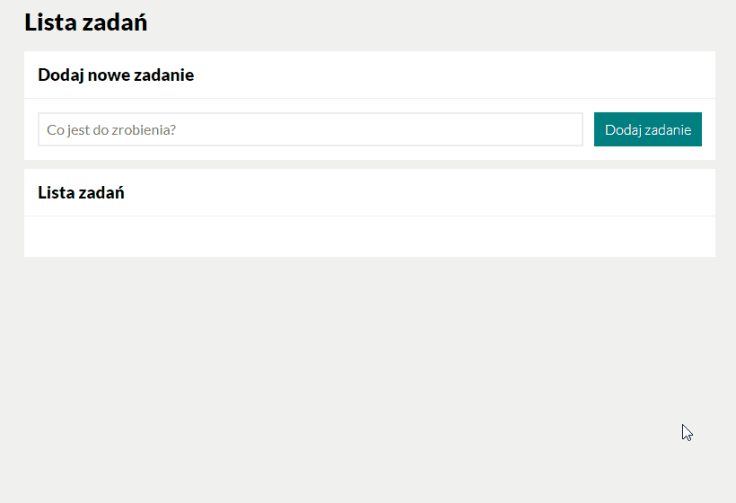

# SimpleTaskList (alpha release - PL lang)

Welcome to SimpleTaskList app!

## Demo

*(English version coming soon)*

https://dawidhm.github.io/SimpleTaskList/

## Description

**Simple Task List** is the application that helps you to keep away *frequent* and *short-term memory lapses* and manage all daily *to-do* tasks in one place.

Everything in one super simple shape to maximise your **effectiveness** and **productivity**.

### Power comes out of simplicity

Our app is very simple, so **it won't distract you** with a million *useless functions*, *goodies* and *blinking lights*. Just write down whatever you need to remember and it's ready. 

Now you can **focus** on doing the **most important thing** without worrying about a *thousand small things to remember* that you might miss!

## App Features
1. Adding new task
1. Removing task
1. Marking task as done
1. **Special Feature**: Ultra fast task adding method

## 1. Adding new task

To add a new task, press the input field, then write a task name and hit the button to add the task.

## 2. Removing task

To remove a task, press the red bin icon placed on the right side of every task you want to remove.

## 3. Marking task as done

Once you've finished a task, you can mark it as done. To do this, press the green square on the left side of the task. A line through will appear on the task, and a completion mark will appear in the green square.

## 4. **Special Feature:** Ultra fast task adding method

### **App can be used with just the keyboard**. 

The currently chosen item has a **black border**. You can easily switch between fields and buttons:

- forwards with the **TAB** *button* 
- and backwards with the **SHIFT + TAB** *buttons combination*

After typing the task name, press **ENTER** *button* to add the task.

### **Automatic focus on input field**

To make adding multiple tasks *faster* and *easier*, automatic selection of an input field has been added. This means that each time you **add a new task**, the **input field selects automatically**. You can quickly *enter multiple tasks* one by one, without having to select an input field every time.

This happens every time you *submit a new task* with a **mouse click**, or the **ENTER** *key*. 

## Future Plans

- Add english language version
- Add functionality to save user data
- Add the order movement function for each task